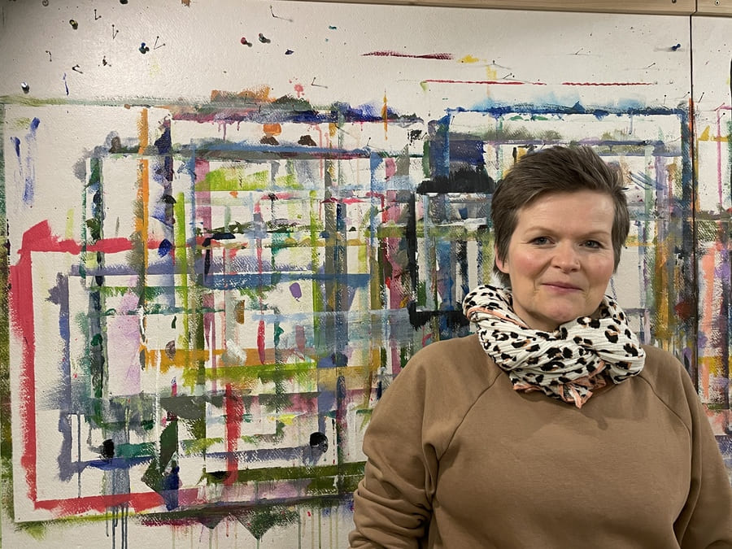

+++
title = "Eine Kunsttherapeutin über Smalltalk und Identität"
date = "2025-02-28"
draft = false
pinned = false
image = "675a9533-b7ae-4794-8bb4-a9e75edd6909-2.jpeg"
+++
\
Ich treffe Christa Reusser in ihrem Kunstatelier, einem Raum im Untergeschoss ihres Hauses, der Wärme, Ruhe, Kreativität und Offenheit ausstrahlt. Alles auch Eigenschaften, welche sie in ihrem Alltag als Kunsttherapeutin benötigt, um Menschen mit psychischen Erkrankungen in ihrem Prozess zu begleiten.\
Im Gespräch erfahre ich, wie die Arbeit in der Psychiatrie ihre Identität verändert und prägt.\


> „Es war nicht eine Person allein, die mich verändert hat, sondern immer wieder Personen, vor allem Menschen mit traumatischen Erfahrungen.“

\
Christa Reusser ist siebenundvierzig Jahre alt und Mutter von drei Teenagerjungs. Sie mag alles, was mit Kunst und Schönheit zu tun hat – von Blumen über Nähen, Gestalten bis hin zu Tanzen.\
Sie arbeitet fünfzig Prozent als Kunsttherapeutin in der Privatklinik Wyss auf der Krisenintervention. Nebenbei gibt sie Kreativkurse in ihrem eigenen Atelier.

> „Ich mag keinen Smalltalk mehr, mich interessiert viel mehr die Tiefe im Leben.“

###### **Annalena Herrmann:** **Hat es ein besonderes Erlebnis gegeben, welches dich persönlich sehr beschäftigte oder langfristig veränderte?**

Christa Reusser: Es war nicht eine Person allein, die mich verändert hat, sondern immer wieder Personen, vor allem Menschen mit traumatischen Erfahrungen, welche mich veränderten in meiner Art zu denken.\
Ich hatte einmal eine Begegnung mit einer Frau, die sehr einschneidend für mich war. Damals war ich etwa sechsundzwanzig und habe mein erstes Praktikum in der Kunsttherapie gemacht.\
Ich bin einer Frau begegnet, die ich gefragt habe, was sie braucht und was ich ihr geben kann. Darauf antwortete sie: „Sie haben so keine Ahnung, ich mache seit vierzig Jahren einen Klinikaufenthalt nach dem anderen, was wissen Sie schon vom Leben?“ Dieses Erlebnis hat mich sehr demütig gemacht.

###### **Was gibt dir dein Beruf Positives, auch wenn es so schwierige Momente gibt?**

Ich liebe meinen Beruf extrem. Ich arbeite wahnsinnig gerne, weil ich den Menschen mit der Kunst immer wieder etwas geben kann, bei dem sie nicht sprechen müssen, sondern nur machen dürfen. Und auch wenn es ihnen extrem schlecht geht, können sie eine kleine Veränderung sehen.

###### **Wie beeinflusst die Kunst deiner Patient:innen deine eigene Kunst?**

Wenn ich viel in der Psychiatrie arbeite, kommt mein künstlerisches Arbeiten oft zu kurz. Wenn ich mich den ganzen Tag mit Kunst beschäftige, habe ich am Abend meist keine Energie mehr dafür. Irgendwann fehlt es mir dann. Manchmal habe ich Leute, die extrem kreativ sind, also sehr gute Künstler:innen. Die Kunst, die sie machen, inspiriert mich, selbst wieder kreativ tätig zu sein.

###### **Wie viel von der Kunst deiner Patient:innen verarbeitest du in deiner eigenen Kunst?**

Ich glaube, nicht sehr viel. Ich habe andere Orte, an denen ich meine Arbeit verarbeite, aber eigentlich weniger in der Kunst.

###### **Gibt es Dinge im Leben, auf die du anders blickst, seit du mit Menschen mit psychischen Krankheiten arbeitest?**

Ja, sehr viele. Zum Beispiel mag ich keinen Smalltalk mehr. Ich interessiere mich viel mehr für die Tiefe im Leben und auch das Schwere, und ich habe viel weniger Angst vor Menschen, die irgendwie schräg sind.

###### **Gibt es Momente, in denen du das Gefühl hast, von deinem beruflichen und privaten Ich hin und her zu wechseln – so wie zwischen zwei Welten vielleicht?**

Ja, es sind extrem zwei Welten. Manchmal überfordert mich das auch. In der Weihnachtszeit hatte ich solche Momente. In dieser Zeit ist es sehr krass, in der Psychiatrie zu arbeiten, weil es den Menschen, die über Weihnachten in der Psychiatrie sind, sehr schlecht geht. Es ist aber auch sehr erfüllend, in dieser Zeit zu arbeiten, weil die Menschen dankbar sind, dass jemand da ist und sich um sie kümmert.\
Der Wechsel zwischen meinen privaten Weihnachtsfeiern – einer Welt, in der es allen gut geht und alle sehr glücklich schienen – und dem Alltag in der Psychiatrie habe ich fast nicht ertragen.

###### **Würdest du sagen, deine Arbeit beeinflusst dich mehr positiv als negativ?**

Ja, also sonst hätte ich sicher etwas verändert. Ich habe früher in der UPD gearbeitet. Dort gab es eine Zeit, in der viele Angestellte des Pflegeteams gekündigt haben und neue Leute gekommen sind, die sehr negativ über die Patien:innen gesprochen haben. Da habe ich gemerkt, ich ertrage das nicht, ich konnte auch nicht mehr schlafen.\
Dort habe ich dann gekündigt und drei Jahre etwas anderes gemacht, habe aber dann gemerkt, dass ich die Psychiatrie vermisse, weil ich es liebe, so zu arbeiten. Ich habe mir dann wieder eine Stelle gesucht, und jetzt ist es wieder gut.\
Wenn die Werte in einem Team nicht stimmen, wird es sehr schwierig, auch gerade wenn es Themen wie zum Beispiel Suizidalität anbelangt.